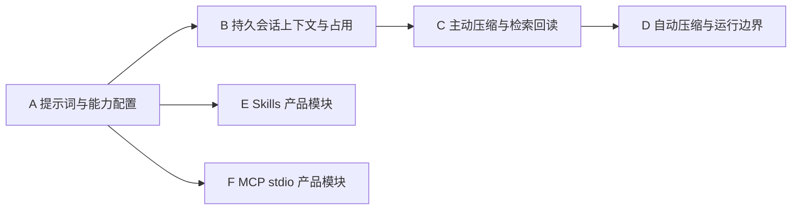

# 会话上下文、提示词、主动检索与 Skills/MCP 总体计划 v1

| 元数据 | 值 |
|---|---|
| 状态 | A 提示词、B 持久上下文、C 主动压缩与检索、D 自动压缩与运行边界已实现；E–F 待实施，实际验证见各批记录 |
| 日期 | 2026-09-23 |
| 基线 | `ce7a714`：工作流主工具栏、唯一上下文面板、反馈与图管理已接入 |
| 范围来源 | 用户要求所有会话区分完整内容与持久会话上下文，提供占用、主动/自动压缩及各自提示词；跨会话信息由 Agent 主动检索；补齐平台/世界等提示词配置与 Skills、MCP 产品模块 |
| 关联 | [上下文阶段记录](context-cache-orchestration-v1.md)、[Agent 运行时](../protocol/internal/agent-runtime.md)、[工作流协议](../protocol/public/rest/workflows.md)、[界面设计](../design/frontend-navigation-theme.md)、[测试指南](../testing/README.md) |

总体计划和导航已建立；A 批已接入，接口见[提示词协议](../protocol/public/rest/prompt-settings.md)，实际结果见[验收记录](../testing/prompt-settings.md)。B 批已接入[持久上下文与占用](../protocol/public/rest/conversation-context.md)，结果见[B 批验收](../testing/conversation-context.md)。C 批已接入[主动压缩](../protocol/public/rest/context-compression.md)与[Memory](../protocol/public/rest/memory.md)，实际结果见[C 批验收](../testing/context-compaction-memory.md)。D 已接入自动策略、逐次容量检查和执行私有压缩，实际结果见[D 批验收](../testing/context-auto-compaction.md)。E–F 继续按实际采用的批次实现，不把计划范围当成全部功能已经可用。批次用于控制范围和验证，不增加每小步审批、独立提交或重复确认门槛；A–F 的依赖以第 9 节为准。

## 1. 目标与现状

目标是让 Owner 能配置角色实际获得的指令、上下文和工具，查看输入占用，维护长期存在的会话上下文，并让 Agent 在需要时检索历史、加载技能和调用 MCP。每个模块必须形成“配置 → 实际生效 → 可查看结果 → 可停止或撤销”的闭环。

下表记录制定计划时的基线及目标；A–D 的后续实现和剩余范围以本节链接及第 9 节状态为准。

| 领域 | 制定计划时的基线 | 本计划补齐 |
|---|---|---|
| 提示词 | [ContextBuilder](../../backend/app/context/builder.py)拼接固定运行规则、角色提示词/skills JSON、会话类型/标题/成员信息 | 平台可配置规则、世界提示词、单聊/群聊会话提示词的持久配置和前端入口；来源、版本与生效范围可查看 |
| 会话上下文 | 每次执行读取消息、投影并按预算选择历史；尚无独立持久会话上下文 | 每个会话长期保存一份共享上下文，随消息同步，支持版本、压缩与来源追溯 |
| 输入占用 | [预算估算](../../backend/app/context/budget.py)为保守 UTF-8 口径，构建诊断主要进入日志；[角色用量](../protocol/public/rest/execution-usage.md)统计已发生调用 | 面向用户的会话上下文体积、按角色预估、最近请求实际用量与构成；执行中工具轮增长也可观察 |
| Memory | 旧计划定义了长期记忆，尚无产品检索能力 | 从当前世界中角色可访问的会话信息主动搜索、回读；先不依赖自动抽取全部长期记忆 |
| Skills | `Role.skills_json` 可保存配置，[角色前缀](../../backend/app/context/builder.py)直接序列化注入 | 技能库、版本、角色绑定、按需加载、已加载状态、资源读取与兼容迁移 |
| MCP | [stdio 管理器](../../backend/app/mcp/manager.py)和内部测试已有连接/调用基础，未接产品入口与模型工具链 | 服务配置、凭据、发现、逐工具授权、真实调用、生命周期和前端状态 |
| 工具授权 | 原生工作区与工作流控制工具已有配置、分配和执行复核 | 统一解析原生、检索、技能读取、MCP 等能力；没有文件工作区的会话也能使用获准的知识工具 |

制定时发现并已在 A 修复的缺陷：[角色表单](../../frontend/src/components/Modals.tsx)原来保存时直接提交 `skills: []`、`mcp_servers: []`，会覆盖通过 API 保存的配置；现行前端省略未编辑字段，服务端保留，显式空列表仍可清除。未开放的字段不能因修改角色名称或提示词而丢失。旧注释、工具可用性说明与实际调用链的差异同时按相关范围修正。

## 2. 会话内容、持久上下文与实际请求

### 2.1 三个对象

| 对象 | 职责 | 持久化与更新 |
|---|---|---|
| 会话内容 | 聊天页面展示的完整消息、工具记录、执行状态及原始证据 | 沿用 messages、工具详情和执行事实；压缩不删除或重写原消息 |
| 会话上下文 | 后续发送给角色的主要会话材料，所有单聊和群聊均有 | 独立持久保存活动版本、压缩段、未压缩消息引用及同步边界；不依赖浏览器是否在线、加载多少历史或服务是否重启 |
| 本次角色输入 | 此次调用真正使用的指令、会话材料、检索结果、任务及工具 | 从确定版本组装；角色视角、可见范围和模型预算可以不同，记录所用版本与占用，不为诊断另存一份完整 Prompt |

同一会话的主要上下文共享，不默认按每个角色复制一套长期历史。角色身份投影、私有检索材料、工作流节点输入和执行内工具轮属于本次输入的适配部分。

逻辑组成如下；工具 Schema 通过 Provider 的工具接口传递，与文本输入一起计入预算。组装顺序需稳定，具体 Provider 编码由适配层负责。

```text
平台固定规则及本世界的平台规则配置
世界系统提示词
角色提示词、已启用技能目录与已加载技能说明
会话提示词及成员身份
持久会话上下文的选定版本
本次角色主动检索到且有权使用的资料
当前任务、当前消息及已闭合的执行内工具交互
+ 本次实际获准的工具 Schema
```

当前消息若已由会话上下文携带，本次输入只引用一次；角色回复、检索材料和工具结果同样要避免重复拼接。启用工具或技能、更新世界提示词，不等于重写全部会话历史。

### 2.2 与聊天页面同步

- 同步消费业务消息的 ID、revision、状态及顺序，不抓取前端 DOM，不以当前页游标作为模型历史边界。
- 真人消息及时进入可见边界；角色流式内容可在页面显示，稳定上下文在消息收口后纳入。界面说明“正在生成，尚未纳入”，不把空占位或不完整工具轮当作稳定历史。
- 停止、失败、部分完成和未知副作用沿用原事实。是否纳入正文与如何标记由上下文协议明确；不把失败摘要改写成成功结论。
- 原内容已有的 revision、删除、恢复或成员变化会使受影响片段失效或重建。对尚未实现的 regenerate 等功能只定义兼容钩子，不在本计划顺带开发。
- 共享上下文保留发言身份和引用；每次组装仍按角色投影。新增或撤销成员权限必须检查上下文摘要是否仍可见，不能只过滤原文而留下越权摘要。
- 以消息所有者/reducer 的既有事务和可靠恢复边界推进同步游标。若采用异步投影，记录待同步范围并可重放；发起执行前补齐所需边界，不因任务丢失默默使用旧上下文。
- 存储使用消息引用与压缩段，避免每次追加都复制整段历史。更新与压缩采用版本冲突检测，不在流式 Token 到达时逐片段开事务。

### 2.3 运行中的快照

每次执行取得明确的可见消息边界与配置版本；普通群聊后续角色仍能读取同一 @ 链中已经完成的前序角色回复。并行执行不会因为其他分支写入新消息而获得不属于本任务的材料。

共享上下文发生压缩时，已经发出的 Provider 请求不变。在下一个安全调用边界采用新材料时，必须仍覆盖该执行原本可见的来源，记录本次调用所用版本；不能顺带读入未来消息。工具权限撤销在实际调用前复核，不等待上下文版本切换。

## 3. 提示词与配置的前端入口

平台规则也要有明确产品入口，不能仅在代码中维护一段不可见文字。按现有 World/Owner 隔离，首版采用以下归属：

| 配置 | 前端位置 | 管理与生效 |
|---|---|---|
| 平台规则 | 系统与环境设置 → 提示词与规则 → 平台规则 | 显示软件提供的默认模板与版本；Owner 可保存当前世界的平台协作/输出规则覆盖、预览生效内容、恢复默认。界面明确覆盖仅影响当前世界，不赋予一个 World Owner 跨世界管理权 |
| 世界系统提示词 | 系统与环境设置 → 提示词与规则 → 当前世界 | 编辑世界背景、公共约定和目标，明确当前 World 名称、版本和作用范围 |
| 角色提示词 | 角色编辑 → 提示词与技能 | 复用现有角色提示词，展示继承规则和技能来源，保留未编辑配置 |
| 会话提示词 | 会话右侧 → 上下文 → 提示词 | 单聊、群聊均可配置会话任务背景与共同约定；Owner 管理，Guest 只读取明确公开的内容 |
| 压缩策略与默认提示词 | 会话右侧 → 上下文 → 压缩设置 | 配置模型、自动开关、阈值、目标、保留策略与自动提示词；可继承世界默认并做会话覆盖 |
| 本次主动压缩要求 | 上下文面板 → 主动压缩 | 输入本次保留重点；默认只对本次请求生效，不覆盖自动提示词 |

可配置的平台提示规则与服务端不可绕过的鉴权、凭据保护、工具准入是两类东西。后者在界面说明，不提供通过改一段提示词关闭它们的开关。平台模板和世界提示词分别维护，不合并成两个含义不明的文本框。

规则按来源分层追加，不因会话配置清空世界/角色配置。显式继承、覆盖、清空和恢复默认需要区分；保存使用 revision，冲突保留输入。软件模板升级不静默覆盖 Owner 自定义内容，提供新旧版本说明与主动采用入口。

配置保存后作用于后续输入组装；已发出的模型请求保持原版本，旧执行记录也不改写。涉及安全授权的停用/撤销立即执行。界面不堆叠完整 Prompt，默认显示来源、顺序、长度和版本，Owner 按需查看具体内容；未生效状态必须明确。

当前不存在独立实例管理员体系，因此本计划不引入跨世界的全局规则发布后台。需要统一维护多个世界模板时可以以后扩展，此取舍不阻塞当前世界的完整编辑入口。

## 4. 占用统计与压缩

### 4.1 统计口径

群聊共享上下文有可统计的材料规模，但“占模型窗口多少”取决于本轮角色、模型、提示词、技能和工具。主会话标题显示简短占用提示，展开后分开列出：

1. 当前持久上下文的版本、覆盖边界、原文/压缩段数量和预估规模。
2. 选定角色下一次请求的预估输入、窗口、输出预留、安全余量和可用空间；未确定角色时不显示一个假装全群通用的百分比。多角色可查看明细并提示下一轮所选角色中的最高压力。
3. 正在执行/最近一次模型调用的输入用量及时间；厂商未报告保持未知。既有累计 Token 消耗继续在执行用量中展示，不作为上下文占用。
4. 指令、会话材料、Memory、已加载 Skills、工具 Schema 和当前工具轮的构成；哪些内容因预算未纳入应可查看。

复用并完善同一套构建与估算逻辑，预览和执行不各自数一遍字符。当前保守估算明确标记为预估，并留出按模型改进估算器的接口；不把 UTF-8 字节数标为厂商精确 Token。

压力判断使用裁剪/压缩前的必要输入需求，防止先裁掉历史后永远显示“未超阈值”。实际工具 Schema 和执行中新增的工具轮都要计入；仅展示启动时数字不能算完成运行期占用管理。

### 4.2 主动压缩

Owner 在单聊或群聊的上下文面板选择压缩范围/保留重点并执行。默认作用于当前会话的历史材料，不修改世界、角色或会话提示词，不删除原内容，也不覆盖其他会话上下文。

压缩对象是当前会话的共享上下文。用于生成摘要的模型配置单独选择，与按角色查看占用/检索分开；复用角色的模型配置不表示压缩该角色自己的历史。当前 C 实现的压缩草稿、任务及活动摘要按会话组织，接口 role_id 只承担模型配置和维护执行关联。

- 每次压缩固定来源版本、覆盖边界、模型配置及所用提示词版本。平台的来源/事实要求、会话默认保留要求与用户本次补充分别记录，本次输入不改写自动设置。
- 默认保留目标、用户约束、已作出的决定、角色归属、未完成事项、分歧、关键引用及已知/未知执行事实；保留最近完整消息。摘要中的推断与来源事实应有区别。
- 来源过长时按完整消息/闭合工具轮分段压缩，再合并；压缩调用本身也有输入/输出预算。模型未配置或容量不足时明确提示，不隐式选择另一个收费模型。
- 压缩任务复用现有 execution、取消和 usage 记录。Owner 主动压缩建立独立维护请求，按现有世界决策配置管理；任务内自动压缩关联触发 execution，并计入原 chain 的预算，不重置原任务额度。复用同一压缩结果的其他执行只引用版本，不重复统计模型消耗。较长调用不占用数据库写事务。
- 成功后校验来源、结构、引用、预算和实际压缩收益，原子发布新版本；新消息追加在保留的尾部。压缩期间旧消息被编辑、删除或撤权时重新校验，失效结果不采用。
- 失败、取消、超时或没有有效缩减时保留旧版本，记录实际原因。重发沿用幂等身份；结果未知时先查询任务状态，不重复付费调用。
- 前端展示进度、停止、压缩前后占用、保留范围、来源和历史版本。回退压缩版本时保留之后的新消息，并重新核对当前权限，不把整个会话倒退到过去。

### 4.3 自动压缩

自动压缩复用主动压缩服务，新增策略和调度，不实现第二套摘要机制。设置包括自动开关、Token 触发阈值、压缩后目标、最近内容保留策略、模型选择和自动提示词。默认值在实现时用受控长对话验证，不在本计划固定候选百分比或轮数。

配置显式启用后按策略运行，不为每次触发重复要求人工确认。目标必须低于触发点，并校验最近保留内容、固定指令与输出预留能否容纳。只修改“下次组装该如何携带历史”，不会停止或重放已完成任务。

同一会话、来源版本和压缩范围去重。会话阈值上限 = 当前会话全部有效角色的最小有效窗口，与本轮是否发言无关。推荐触发阈值 = 会话阈值上限 − 建议预留；建议预留 50k，可调整，小窗口不能容纳该建议时明确显示调整值。配置阈值不得高于会话上限；成员、模型或窗口变化后重新计算，已有配置过大时收紧实际生效值并提示。多个角色同时达到阈值时复用可见范围兼容的压缩结果。冷却/增量门槛与收益检查防止每轮滚动重写，失败不会形成收费重试循环。

每次 Provider 调用前检查实际增长。共享历史压缩不足以解决执行内工具轮增长时，只在闭合工具轮之间生成该执行可见的压缩快照，复用同一服务与来源规则；不得拆断调用/结果配对或省略尚未确认的副作用。不能处理的必需输入超限应明确阻止本次请求，而不是静默丢弃。

执行内快照只替换该 execution 后续调用的对应材料，不改写共享会话上下文的活动指针。执行结束后允许共享的回复和事实仍经正常同步路径纳入，不能把角色私有工具内容借压缩发布给全群。

工作流的明确上游结果、判断字段、授权、图版本和 attempt 引用保持准确。可压缩的长正文按精确来源处理，不能把共享群摘要替换成某个节点的上游结果，也不能从旧轮次检索出值后冒充本轮判断。工作流和群 Orchestrator 的入口全部经统一组装与授权检查。

## 5. Agent 主动检索 Memory

本计划中的首版 Memory 能力是“当前世界内，角色主动搜索可访问的历史信息”。完整会话、压缩摘要和以后显式保存的长期记忆都可以成为来源，类型要明确区分；不要求先把全部聊天自动提取成记忆条目。

| 候选工具 | 输入意图 | 输出与边界 |
|---|---|---|
| `memory_search` | 自由查询，选择当前会话/关联会话，按来源类型或时间等条件收窄 | 返回有界片段、相关性/匹配说明、来源会话、发言者、时间、版本和后续可读引用；支持继续搜索 |
| `memory_read` | 根据合法来源引用读取原文及必要的前后文 | 返回可核对内容、精确范围、状态、版本、截断与继续读取信息；读取时重新鉴权 |

名称和细字段在该批协议中定稿，工具说明、参数 schema、ContextBuilder 暴露及实际执行必须一致。World、角色、触发者和授权从真实 execution 取得，模型参数不能另选身份，也不开放 SQL 或任意宿主文件读取。

检索范围按当前有效角色关联、触发者读取权限和输出会话共享范围共同决定。仅同处一个 World 或过去参与过某群不自动产生永久访问权；删除、成员撤销、来源修订和失效索引须在返回前过滤。拥有角色私有资料访问权也不等于可以把它透露给当前群的所有成员；不能将不允许共享的原文或摘要交给会公开回复该群的模型。

首版通过已有消息及可重建文本索引提供搜索；压缩后的历史必须仍能回读原消息。先建立检索适配接口并验证中文、英文、代码标识符与准确引用；全文/向量实现根据实测选择，不把旧 LIKE-only 排期或新向量数据库当成永久前置。

获授权角色稳定获得工具及简短使用说明，不在每轮自动塞入检索片段。涉及跨会话约定、未知实体或摘要省略的细节时由 Agent 主动搜索、改写查询、再读取证据。无结果或权限不足明确返回，不推断为“从未发生”。关键当前任务约束仍直接提供，不能仅藏在可搜索资料里。

检索结果作为有来源的背景资料进入该执行，复用工具调用记录；共享上下文只纳入允许共享的材料及引用，重复读取可以沿用同一版本，不依赖模型是否复述来判断“已知”。后续压缩保留来源与可见范围，不将历史对话中的命令提升成平台规则。

Owner 的上下文面板提供搜索、原文查看和 Agent 本次引用记录，使用相同权限与检索服务。Agent 和人都能验证“压缩后找回遗漏细节”，不只交付一个搜索接口。

## 6. Skills 产品模块

技能描述“如何完成任务”，工具提供实际调用能力。技能声明需要某工具只能帮助检查配置，不能自动授予工具、启动进程或绕过审批。

- **世界技能库**：在当前世界提供独立的“能力库”入口（暂名），集中管理 Skills 和 MCP，设置页与角色编辑保留跳转/绑定入口。Skills 提供列表、创建/编辑说明、版本、停用、依赖说明、Markdown/SKILL.md 导入和资源预览。定义与版本归当前世界，不默认跨世界共享。
- **角色绑定**：角色编辑 → 提示词与技能，选择启用的技能和版本策略。会话/任务可以在已有授权内指定所需子集；不能通过节点文字挂载另一个角色的私有技能。
- **加载方式**：模型先获得有界技能目录（名称、用途及稳定引用），用户明确选择或模型通过候选 `skill_read` 读取已授权的完整说明/资源。加载后在本次输入中稳定保留，避免每轮重复读取或将整个技能库永久塞入角色前缀。
- **资源与执行**：技能资源按导入包/世界受控存储授权，校验路径和链接；凭据不放进技能正文。读取脚本不执行脚本，执行继续走已有获准工具与生命周期。
- **可见性**：前端区分已启用、已加载、版本已更新、所需工具未授权和停用。加载失败保留原任务状态，说明缺失内容；工具正文不是角色自行提升权限的依据。
- **兼容**：保留旧 inline `skills_json`，提供可核对的导入/转换，不因新版技能库上线静默丢弃旧说明。角色常规编辑先修复配置清空问题，转换后仍能追溯原定义；新数据字段随实际实现提供迁移。

验收必须有 Agent 实际读取技能并完成受控任务的路径，以及未启用技能、越界资源、停用和版本变更路径。只有 CRUD 表单、只有 JSON 注入或只显示技能名称都不算该批完成。

后续组织方向：能力库支持列表与知识图谱视图，以分类、用途、技能及其依赖/关联组织资源。优先从现有[工作流画布](../../frontend/src/components/workflows/WorkflowFlow.tsx)抽取可复用的缩放、平移、选择、分组、布局和详情交互；现有组件包含工作流状态依赖，需要解耦后复用，分类关系不沿用工作流的执行语义。

世界 Orchestrator 接入后提供“一键整理”，在授权范围内整理分类、关联和布局，尊重用户固定项，变更可查看并撤销。这一方向本次只记录，不现在实现；能力库的人工管理与 Skills 基础功能不以世界 Orchestrator 为前置。

## 7. MCP 产品模块

MCP 首版复用已有 stdio 技术基础，但内部 spike 不直接当作产品运行器。先实现“配置 → 连接 → 工具发现 → 角色启用 → 实际调用 → 停止/撤销/回收”的完整链路。

### 7.1 用户入口与数据

- 独立能力库 → MCP：新增/编辑服务、命令与参数、受控工作目录和环境配置，测试连接，发现/刷新工具，查看状态与安全错误摘要，停止/重启/停用服务。与 Skills 使用同一资源管理入口。
- 配置与运行分开。保存配置不暗中启动进程；“测试连接”和实际使用是有明确效果的操作。服务工具清单变化显示差异，新发现工具不自动加入角色授权。
- 敏感环境值和认证材料加密存储，API 返回脱敏信息或凭据引用；普通角色配置只保存服务/工具绑定。旧 `mcp_servers_json` 保留并迁移，角色编辑不再清空它。
- 角色编辑 → 工具与 MCP：按具体服务和工具选择。会话/工作流查看本次分配和不可用原因；MCP 工具使用稳定服务身份及命名空间，不能冒充原生或图管理工具。
- 原始调用详情沿用 Owner 私有工具详情、加密、保留与降级机制。未知结果类型可显示受控占位或引用，不让整条消息渲染失败。

MCP 服务、所提供的工具、分类及与 Skills 的依赖/关联纳入同一知识图谱，复用上节的通用画布交互。未来由世界 Orchestrator 一键整理这些组织信息，资源身份和角色绑定保持可追溯；整理本身不改变工具授权或触发服务调用。本次只补充计划，不提前实现知识图谱或世界协调入口。

### 7.2 真实执行与生命周期

工具集合从统一能力解析结果进入实际 Provider Schema、预算和工具工厂。每次调用检查当前角色启用、会话授权、execution/任命状态及服务版本。MCP 和未知工具默认 dangerous，远端只读/安全标注不能自行授予 safe；沿用既有 Owner/Guest 规则和逐工具配置，不新增无关的反复审批流程。

MCP 不是宿主沙箱。资源和副作用不因工作目录、工具名称或服务自述变得可信；共享宿主按已确认能力协调并发，未知副作用采用保守准入，不将 MCP 当作绕开共享工作区修改互斥的入口。停止或超时后，已提交、未执行和结果未知分别记录，未知副作用不自动重试。

复核现有管理器，至少覆盖：

1. 宿主打开/关闭在同一异步任务，池键包含 World、Owner 和配置/凭据版本；共享连接不跨越身份边界。
2. 调用者在排队、初始化和实际调用期间取消时的不同语义：未开始请求不得之后偷偷执行，正在执行的请求有明确收口结果；取消一个等待者不使其他合法使用者永久挂起。
3. 关闭、启动失败、服务崩溃、撤权和 World 切换时，所有等待 Future 都有终态；不能只删除池对象却留下请求或进程。
4. 进程所有权必须准确，不能凭并发启动前后的任意子进程差集误认 PID；终止进程树后确认回收，未确认时不显示“已停止”。
5. Windows 保留 Proactor，正确解析可执行文件和 `.cmd`，明确环境与编码；Linux 测试和旧 Windows spike 不能替代本次 Windows 实机证据。

首版传输为 stdio；远程 MCP 作为随后独立切片，先核对客户端版本、传输和认证、断连/取消语义，再提供对应配置界面。首版不假装支持尚未接入的远程地址，也不要求为了本地 MCP 先实现外部账号系统或市场安装功能。

## 8. 共同接口、存储与兼容工作

### 8.1 能力解析

在既有角色配置、`ExecutionAllocation`、工具工厂和执行复核基础上形成唯一的本次能力结果，包含稳定工具身份、Schema、来源、可用状态和授权范围。原生工作区、Memory/技能读取、MCP、协调控制分别声明自身资源条件；不能继续用“是否在工作区工具列表”代替所有工具的可用性。

普通角色与工作流节点可以获得明确分配的检索/技能/MCP 能力；图管理工具仍只授予有对应职责和目标的协调执行。技能不替代工具授权，Memory 不依赖文件根；获得 MCP 也不自动获得读图/改图权。不要另建一套并存的任务分配或日志追踪。

### 8.2 候选数据与接口职责

以下是设计对象，不是现有 API 或已定稿字段；实现对应批次时在领域协议中确定 wire 格式、状态、错误与迁移。避免现在创建尚无读取方的空表。

| 对象/操作 | 至少需要表达的事实 |
|---|---|
| 各层提示词配置 | World/角色/会话归属、默认或覆盖、正文/版本、生效来源和更新时间 |
| 会话上下文及版本 | 活动版本、来源消息 revision/范围、压缩段/近期段、可见范围、同步进度、失效原因 |
| 压缩任务 | 来源版本、覆盖边界、模型和提示词快照、触发类型、幂等键、既有 execution/预算关联、状态、采用版本与实际用量 |
| 上下文状态/预览 | 按角色和执行的预估/厂商口径、组成、未纳入原因、来源版本；读取不触发模型或压缩 |
| 检索与原文回读 | 查询、过滤和游标、引用/版本、精确来源、可见范围、截断及缺失状态 |
| 技能定义/版本/绑定 | 当前世界定义、说明与资源、角色绑定、启用/加载/失效关系，兼容旧 inline 内容 |
| MCP 定义/绑定/实例 | 当前世界配置、加密凭据引用、工具清单版本、逐工具授权、宿主和请求生命周期 |

配置修改带版本冲突检测；压缩、重试、导入等可能重复的请求使用幂等身份，重发不能产生重复模型费或覆盖新结果。读取快照与 WS 增量共同支持刷新/重连；未知客户端保留降级，推送默认只含必要状态/身份，不广播私有提示词、检索正文或凭据。

新增持久数据通过 Alembic、SQLite 重放和模型一致性检查建立；涉及 PostgreSQL 实际部署或专属行为才补实例验证，不以离线 SQL 代替运行。已有会话要可恢复地回填上下文和同步边界，旧上下文不能因升级清空；大历史采用有进度的分批构建，不用无界全量查询阻塞每次请求。

检索索引可重建，原消息是来源事实。持久上下文虽然可由来源重建，其用户选定压缩策略、已发布版本和引用不能在升级/恢复时静默丢失。备份、World 切换及停机需要纳入新增任务/实例的收口，备份含凭据时继续作为敏感数据保管。

### 8.3 前端组织

提示词与规则继续由设置页管理；Skills 和 MCP 集中在独立能力库，设置页与角色编辑提供跳转和绑定入口，知识图谱方向见第 6、7 节。已有模型、世界存储、工作区和账号入口保留。未完成模块不显示可点击却无实际效果的假控件。

会话右栏增加“上下文”模块，仍一次只显示一个模块，与现有概览、成员、工作流并列。内容/实际输入预览、压缩、提示词和检索记录在该模块内部切换；标题区只保留占用与状态。角色表单按提示词/技能、工具/MCP 分组，不把所有 JSON 和完整日志铺在主页面。窄屏使用原详情抽屉，保留焦点、返回位置、未保存输入和权限降级。

## 9. 实施顺序与可独立推进的部分

A–D 已完成并有独立验收，后续方向为 E Skills 和 F MCP 产品模块。建议单线执行顺序为 **A → B → C → D → E → F**。E/F 的实质前置是 A 的配置保留与统一能力接口，可以独立提前推进；B–D 不等待技能库或 MCP 完工，也不等待世界 Orchestrator。



| 批次 | 可独立交付的结果 | 本批完成证据 |
|---|---|---|
| A：提示词与能力配置（已实现） | 平台默认/世界覆盖、世界/角色/会话提示词前端与持久化，生效来源可查看；角色编辑保留 Skills/MCP；能力解析接入原有工具链 | 修改规则后下一次真实输入采用对应版本；旧配置不丢失；角色、World、Guest 与执行授权矩阵；原文件/图工具继续工作 |
| B：持久会话上下文与占用（已实现） | 全部单聊/群聊有可恢复共享上下文，随消息同步；按角色查看请求占用与构成，运行中数值有明确调用边界 | 刷新/重启、流式收口、同一 @ 链前后角色、消息修订与权限变化；预览/实际组装一致，预算与厂商用量不混淆 |
| C：主动压缩与主动检索（已实现） | Owner 输入本次要求压缩，版本/效果/取消可查看；Agent 实际调用 `memory_search/read` 搜索关联会话或回读被压缩原文 | 压缩后继续协作并找回原始细节；查询引用可核对；角色与目的地权限拒绝；压缩期间新消息/旧消息变更、重复提交和失败保持原事实 |
| D：自动压缩与运行边界（已实现） | 自动开关、阈值/目标、默认提示词、模型和保留策略生效；每次调用前检查，安全边界采用，必要时处理执行内增长 | 长对话自动触发一次并继续；多角色竞争去重；工具轮完整；无收益/模型失败/取消降级；工作流并行、循环和精确上游不串入错误结果 |
| E：Skills | 技能库、版本/导入/资源、角色绑定、按需加载、停用与前端使用状态；旧 inline 兼容 | 模型实际选择并读取技能完成任务；未授权/越界资源/版本停用拒绝；技能变化不扩大工具权限或删除角色已有配置 |
| F：MCP | stdio 服务配置、凭据、连接/发现、逐工具绑定、实际模型调用、停止/撤权/崩溃恢复与平台收口 | 真实前后端 + fake Provider + 受控 MCP server；工具调用有原记录；启动/排队/在途取消及共享宿主不挂起；World 隔离；受影响系统进程树清理证据 |

A–F 每批同步功能和对应回归，不能先堆全部表单再推迟实际调用链。C 的最小检索随压缩一起验收，D 复用 C；必要缓存一致性检查随 A–F 进行，更大规模缓存命中率优化另按实际瓶颈安排。

## 10. 验证与文档维护

- 后端使用确定性 fake/mock Provider；按批次覆盖权限、版本竞争、幂等、取消、未知结果与恢复。上下文/压缩并发测试需确定性控制消息追加、来源修改和任务提交的先后。
- 新流程使用真实前后端 Playwright。跨角色检索、压缩、技能和 MCP 都需实际调用对应工具并核对结果；只有编译、工具列表或 API smoke 不能宣称产品闭环。
- MCP 使用受控本地测试服务，覆盖正常、延迟、崩溃、异常内容和子进程树；不依赖第三方服务可用性或在普通测试中下载执行不受控包。
- 必要缓存测试验证提示词/技能/工具/上下文版本只使相应指纹和输入变化；权限改变优先于缓存稳定，不承诺固定命中率。
- 批次确定性验收不默认调用收费模型。真实模型对摘要质量、主动检索/技能选择或 MCP 调用的验证另用既有专用 real-world 入口，说明联网计费并按该次采用的范围执行，记录实际模型与覆盖缺口。
- Windows、移动设备、其他浏览器、PostgreSQL 的实际验证与未覆盖部分分开记录；历史 spike 或另一平台通过不自动替代本次证据。
- 正式日志只保留现有请求/执行关联、状态、版本和安全数字摘要；Prompt、会话原文、检索内容、技能正文、源码和 MCP 凭据不进入日志或失败产物。敏感内容在受权限保护的业务存储与详情中处理。

实现时按职责更新权威文档：[角色](../protocol/public/rest/roles.md)、[会话](../protocol/public/rest/conversations.md)、[World](../protocol/public/rest/worlds.md)、[运行时](../protocol/internal/agent-runtime.md)、[工作流](../protocol/public/rest/workflows.md)、[用量](../protocol/public/rest/execution-usage.md)、[WS](../protocol/public/websocket/conversation-stream.md)、[数据模型](../protocol/internal/data-model.md)和[错误码](../protocol/error-codes.md)。新领域协议在对应批次创建并纳入[协议索引](../protocol.md)，本计划不冒充已实现契约。

README 只在功能落地后更新可用事实；界面行为写入现行设计，测试命令和数据管理归测试指南，各批实际结果记录在 testing。本文维护总体范围、取舍和依赖，不重复维护已定稿字段。

## 11. 与旧计划的调整及后续方向

| 旧候选方案或排期 | 本计划采用的调整 |
|---|---|
| 仅每次从 messages 构建；C3 只补一个压缩摘要 | 全部会话有长期保存、持续同步的上下文；Checkpoint 成为其中的版本化压缩段 |
| 只有历史超过阈值才压缩 | 主动请求和自动策略共用服务，两套提示词的保存/使用范围明确 |
| Memory 首版仅 Owner 逐条确认的长期记忆，检索自动注入 | 先提供角色主动调用的关联会话检索/回读；显式长期记忆与自动提取以后扩展，不作为历史检索前置 |
| 平台规则写代码，世界/会话提示词缺少编辑入口 | 平台默认模板与本世界覆盖、世界提示词及单聊/群聊提示词均有明确入口和生效版本 |
| skills/MCP 字段存在即被当作已支持，角色编辑写空占位 | A 先保留数据，E/F 各自交付管理、加载/连接、实际调用与撤销闭环 |
| 普通任务的工具分配主要按工作区工具筛选 | 按工具类别与实际资源解析；知识工具不依赖文件根，MCP 不继承原生文件安全承诺 |
| C4/Memory/导出/世界编排按旧阶段互相等待 | 必要验证随当前批次，其他能力按真实依赖独立安排 |

世界 Orchestrator/桌宠 API、跨世界 Memory、自动长期记忆抽取、复杂向量检索、技能市场/任意包执行、远程 MCP、Repository/Git/worktree 和新的费用/时间预算系统保留为可独立评估的后续方向，不作为 A–F 的隐含前置或自动扩展任务。此范围划分不构成以后实现它们的永久限制。

初次制定计划时只做文档检查；A 的实现、迁移和实际验证见[提示词配置验收](../testing/prompt-settings.md)，B 见[持久上下文验收](../testing/conversation-context.md)。C 见[主动压缩与检索验收](../testing/context-compaction-memory.md)。D–F 尚未实施或验收。
