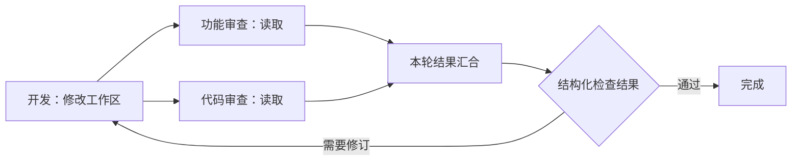

# 群 Orchestrator、工具分配与并行循环执行计划 v1

| 元数据 | 值 |
|---|---|
| 状态 | 基础实现已具备：群任命、固定图分配/上报、并行循环与资源协调；本页只记录基础阶段，图管理与重规划的后续实现及验证见专项记录 |
| 日期 | 2026-09-17 |
| 复核日期 | 2026-09-21 |
| 维护者 | Roleplex |
| 范围来源 | 本轮先定群 Orchestrator，由群内角色任命产生；世界 Orchestrator/桌宠 API 后续考虑；群内工具分配、并行、汇合与循环一起交付，共享工作区修改互斥，Git/worktree 不作为前置 |
| 已实现基线 | `9c249b1`：流程编排与保存、串行运行、可选人工确认、节点详情/停止/重试、React Flow 画布；`53d70ab`：会话工作区与群聊文件工具 |
| 核对来源 | `backend/app/workflows/`、`app/scheduling/conversation.py`、`app/workspaces/tools.py`、`app/workspaces/access.py`、`app/services/agent_budget.py`、现行领域协议与测试入口 |

2026-09-21 整改前复核：当时 `workflow_plan` 只对已冻结图提交分配，`workflow_result/summary` 只上报结果；协调者没有读图/改图工具，且必须先有完整可运行定义才能进入规划。代码存在按 execution/phase 的授予和撤权检查，但尚无图管理授权作用域。新增图操作、规划入口与授权生命周期、运行图版本和验收修正以[图管理与重规划整改计划](orchestrator-graph-control-v1.md)为权威；本文保留已实现基础和原设计背景，不再承担当前整改排期。

本计划取代旧计划中把并行、条件分支和循环笼统推迟的后续安排。串行是已完成首版的实现范围，不是长期产品边界。**群协调者任命及实际模型协调、工具分配、资源协调、并行分支、汇合及条件循环一起纳入本阶段交付与验收**，不以先完成 Git/worktree 为条件。

本轮范围限定于群 Orchestrator。用户提出的后续层级为“世界 Orchestrator → 群 Orchestrator”，桌宠可作为世界级入口；世界级配置、跨群分派和桌宠 API 接入本轮不设计、不实现，也不作为群级功能的依赖。

现行 API 和安全边界仍以[工作流](../protocol/public/rest/workflows.md)、[工作区](../protocol/public/rest/workspaces.md)、[Agent 运行时](../protocol/internal/agent-runtime.md)等协议为准；本文保留采用的实施范围，实际字段和支持边界以已同步的协议为准。

## 1. 目标与实施前差距

Owner 从群内已有角色中任命群 Orchestrator，由该角色的模型根据本次目标协调本群成员、提出任务分工与工具需求、分析汇合结果并汇总。后台调度服务校验分配、运行并行/循环并协调实际资源；推理或读取不因另一个角色存在而被迫全程串行，共享工作区的修改仍互斥。

已有定义、运行快照、节点尝试、工具事实、预算、画布与事件恢复继续复用。实施前需要改造的限制如下，现已由 v2 替代；v1 仍兼容：

| 实施前实现 | 本阶段调整 |
|---|---|
| `orchestrator_enabled` / `orchestrator_role_id` 仅是会话预留配置 | 接入 Owner 任命入口、协调角色实际模型执行及受控分派；任命不改变角色全局身份或其他群的权限。 |
| `serial_execution_graph` 在启动时拒绝分支与环路 | 校验明确的分支、汇合及循环语义，保留合法结构后执行；不把通用图强行排成一条链。 |
| `WorkflowRun.cursor` 与按节点选一个当前尝试的 `selected` 驱动运行 | 记录本次被激活的节点、依赖和循环作用域，区分迭代与重试，不用单一游标表示所有进度。 |
| 会话调度器每个会话只有一个活跃执行 | 普通 `@` 仍按现行顺序；工作流按依赖派发多个就绪节点，独立跟踪每个 execution 的取消与收口。 |
| `ExecutionWorkspace` 的 ready lease 排斥同工作区其他执行，覆盖角色整个执行期 | 分离资源绑定/能力上下文与实际操作占用；共享读和冲突修改在工具调用边界准入。 |
| 运行保存角色启动时可用工具，并把缺失看作能力变化 | 增加本次任务明确分配的工具集合，区分撤权、配置变化、资源排队与执行故障。 |

本计划中“群 Orchestrator”专指被任命的协调者 Agent，“后台调度服务”指非模型的执行控制与资源仲裁。原范围把自动生成整张图排除为前置，却未将读图、改图和运行重规划定义为明确交付，留下仅完成固定图分配/上报的缺口。新整改明确要求从目标/草稿进入并真实修改图，不能再引用原表述将这些能力延期。

### 1.1 群内任命与职责

| 对象 | 位置与职责 |
|---|---|
| 群 Orchestrator | 当前群中一个由 Owner 任命的存活、启用角色，继续使用该角色已有模型配置和提示词；协调本群任务、角色分工、工具需求、结果判断与汇总。 |
| 工作节点角色 | 当前群内被分派具体任务的角色，只获得本次任务所需且原本已获授权的工具，不自动继承协调工具。 |
| 后台调度服务 | 统一校验角色/资源授权、落实任务工具集合、执行依赖与循环、管理读写准入、持久状态、停止和恢复。 |

- 任命属于会话关系；同一个角色在不同群可有不同职责。复用现有会话预留字段作为配置基础，不新增一个全局“超级角色”类型。
- 成员模块提供任命、更换、取消与协调者标记，工作流模块展示当前群协调者并提供“协调执行”入口。配置更新使用会话 revision，且只允许任命本群中属于当前 Owner 的有效角色。
- 更换、取消任命、移出角色或停用时，旧协调执行不再拥有派发权；相关活动执行按停止/撤权语义收口并保留事实，不把旧运行静默移交给新角色。后续协调执行使用新配置和明确的来源关联。
- 被任命的角色可作为普通工作节点承担任务，但该工作节点不继承协调分派能力。协调工具只在已授权的协调执行上下文中暴露，普通节点不能递归取得同等分派权限。
- 协调者仅管理本次授权的群、运行与节点，不因任命取得 World 管理、跨群派发、其他角色配置修改或 Shell 审批代签能力。

### 1.2 调用入口与协调过程

- 通过明确的“协调执行”入口发起，请求区分协调模式与普通聊天；输入栏可复用已有组件。普通发送、`@` 和 `@全部` 沿用现行行为，不因预留字段或任命配置存在就暗中改成另一种调度。
- 手动编排的流程仍可直接运行，不强制每个群都任命协调者，也不让单聊运行依赖群协调者。后台并行/循环能力由两种入口共同复用。
- 协调者读取本次目标、选定流程、本群授权成员的能力摘要与明确上游结果，输出可校验的角色分工、工具需求或结果判断。用户已指定的任务和角色得到保留；合法调整经版本边界生效，不偷偷修改正在执行的节点或角色全局提示词。
- 分配先由后台按授权与资源规则校验、持久化并派发，再向界面报告已安排；模型文本本身不等于已发生调度。能力不足、无可用角色和无效结构化结果提供准确反馈，不通过循环调用掩盖失败。
- 在规划、需要语义判断的汇合和汇总时调用协调者模型；工具加锁、排队、预算扣减及已明确的条件求值由后台执行，不为每一次工具调用增加协调者模型确认。
- 协调模型使用可追溯的 generation/execution，并与角色子执行关联；其规划、分派结果与汇总在群/工作流中可查看。它的模型调用使用本次运行的共享预算并记录实际 usage，子节点与循环不重新获得完整额度。

## 2. 每次任务的工具分配

- 角色全局配置描述 Owner 授权的能力上限；节点可声明所需工具，群协调者提出本次任务的分工与工具需求，由后台调度服务校验并建立明确分配。手动流程可直接提供相同的分配输入；缺省配置可按当前角色可用能力初始化，并向 Owner 展示，不从角色名称或模型自述推导权限。
- 实际可分配集合取任务请求、Owner/角色授权、会话类型与工作区能力的交集。缺少必要能力时报告准确缺口；不自行打开全局工具开关，不把一项新权限扩散到同角色的其他并发任务。
- 分配绑定运行、协调执行（若有）、节点激活、循环轮次与本次尝试，记录工具、资源范围及授权来源。正常执行期间保持一致；需要调整时经明确的版本边界更新相关执行，不因其他分支的动作覆盖它。
- 模型看到的工具 schema、ContextBuilder 使用的工具策略/预算与实际工具工厂消费同一份分配，避免模型能看到却无法调用、未授予却可调用或缓存指纹不一致。
- 实际调用继续复核当前 Owner、成员、角色、工具开关和资源归属。分配快照不能让撤销失效；撤权影响相关任务及其依赖，历史结果仍保留。与本次分配无关的全局工具变化不应误判成当前任务撤权。
- **资源忙不等于权限消失。** 保持获准工具定义稳定，在操作入口有界、可取消地等待资源，并展示等待原因；等待结束重新核验版本、权限及取消状态，不要求模型重复生成相同参数来轮询锁。
- 工具危险等级和资源访问方式是不同维度。文件读取可以共享执行，仍沿用当前 dangerous 与 Owner 边界；不能因为“只读”就自动标成 safe。
- 工具的读/写/外部副作用由服务端可信定义声明，未知工具不默认按共享只读执行。命令、Shell、服务和 MCP 的权限、审批与生命周期仍按各自协议；本计划不自动向群聊开放目前未接入的工具。

分配状态属于运行控制数据，沿用现有 execution 和 Trace 关联。日志只保存允许的身份、工具名、等待分类及计量，不持久化路径、任务正文、参数或完整模型输出。

## 3. 资源协调与并行边界

| 操作 | 本阶段目标行为 |
|---|---|
| 纯推理、对已确定输入的分析 | 依赖满足且有并发槽时可同时执行，不申请文件独占资源。 |
| 原生列目录、搜索、读取 | 同一工作区可以共享读取；每次返回保留实际版本与不完整信息，不能声称多次工具调用形成全局文件快照。 |
| 同一共享工作区的原生写入/编辑 | 修改阶段排他执行；其他角色的独立推理继续运行，不独占其整个 Agent 回合。 |
| 相关读取与修改相遇 | 在受控文件操作边界协调读写；读取所得版本随结果关联，写前再次核对。文件已变化时明确冲突或结果过时，不将旧审查结果冒充当前结论。 |
| 独立资源与存在外部副作用的工具 | 按真实冲突范围与既有生命周期规则协调；不同工具名或工作区 ID 不足以证明资源互不冲突。 |

同一共享工作区最多一个受控修改进入提交临界区。互斥覆盖必要预检、最终权限/版本复核和修改提交；不覆盖模型推理、人工等待或锁外 diff 计算。读取后申请修改时不保留共享读占用等待升级，避免死锁；版本变化按原冲突语义处理。

资源身份来自服务端规范化根与真实归属，别名、重叠根和跨会话访问必须识别冲突。资源仲裁不能只在单次流程内有效，也不能用全局数据库锁或新增 Uvicorn worker 实现。

并发槽位与文件占用分开管理，避免任务占满执行槽后都等待彼此持有的资源；有明确的可配置并发容量、公平排队、取消与回收行为。容量需有实际资源依据，排队状态可见，不重新引入任意节点数或批量参数业务限制。

此协调只覆盖 Roleplex 控制的操作。外部编辑器、已批准任意脚本或服务自身可能修改文件；继续依靠版本核对与既有服务占用门槛，不声称提供 OS 沙箱或跨文件事务。运行中服务的原生编辑策略不因新增并行而自动放开。

Git/worktree 不参与本阶段的必需路径。只有未来确实需要独立分支同时修改、随后合并时，才将其作为可选隔离方式接入；它不能替代当前的权限、版本、资源和结果管理。

## 4. 并行分支与汇合

- 用已满足依赖的就绪节点集合驱动派发。一个运行可有多个活跃节点，每次激活先持久化身份和明确输入，再进入现有 generation/execution 路径；重复唤醒不重复启动。
- 连线需要区分并行分发与条件选择；入口、出口和依赖明确，不通过坐标、节点数组顺序或模型回答中的措辞猜测分支语义。
- 汇合默认等待本轮实际激活的全部必要分支。未选择的条件分支明确跳过，不成为永远无法满足的输入；不按所有画出的入边盲目等待。
- 汇合引用具体上游激活和尝试，输入按定义的稳定顺序组织，而非完成时间先后。快速分支、重复事件或前一轮结果不能抢占另一分支的位置。
- 分支失败或撤权阻止依赖它的后续派发；独立分支可继续收口并保留结果。运行汇总指出未完成的依赖和失败来源，不能在还有活跃执行时声称全部结束。
- 人工确认只阻塞依赖该确认的路径，独立分支继续运行。确认、停止、重试与资源撤销竞争有版本检查与唯一派发语义，等待不持有 worker、文件占用或数据库事务。
- 普通聊天与工作流共享现有身份和消息所有者规则。一个节点的流式回复只由自己的 reducer 更新；工作流可以并行，不改变普通 `@` 的串行接口语义。

## 5. 条件与循环

循环执行是本阶段功能，与异常重试分开建模。画布已经能保存环路；新增的是可配置、可校验并真正执行的入口、循环体、回边及退出条件。

- 条件消费经过 schema 校验的结构化结果或人工决定，由服务端受控规则求值。不能从正文中搜索“通过/完成”，不能执行模型提供的任意判断脚本；缺失、无效或互相矛盾的判断明确受阻，不默认再循环。
- 循环每轮创建新的节点激活和 execution，保存循环作用域与迭代身份；同轮失败后的重试另有尝试身份。保留历史轮次，不反复覆盖同一个 node_id 的“当前结果”。
- 输入明确选择当前轮上游结果与循环声明要携带的上一轮结果，不将旧成功、其他并行分支或其他轮次的结果混入。本轮上下文使用必要引用，不自动把全部历史尝试累加到 Prompt。
- 支持循环体内的并行分支和汇合。只有本轮必要分支交接完成后才判断进入下一轮或退出；停止后不能因为迟到结果重新激活回边。
- 循环定义有明确退出条件；Owner 可按任务配置次数上限，但不硬编码三轮、五轮等产品限制。沿用已有共享决策预算、自定义/不限模式和用户停止，不新增统一时间、Token 或费用门槛。
- 循环条件判断与等待不能形成不让出控制权的忙循环。没有可推进路径、输入不可得或节点失败时给出定位信息，不以无限重试掩盖图或条件错误。
- 工作流循环与角色内部的模型—工具循环是两层机制，共用现有运行预算归属；分支、迭代、重试和人工确认都不自动续额或清零已有计数。

存量图的普通连线不携带完整条件语义，不能在升级后自行猜测已有环路如何运行。编辑保存继续兼容；启动前明确指出需要补充的分支/循环配置，不再以“非串行”一概拒绝语义完整的流程。

## 6. 停止、重试与恢复

运行控制要精确覆盖活跃节点集合、待资源准入的操作、人工等待和下一轮派发，不再依赖每会话单个 `_active` 或单个 cursor。

- 停止先关闭该运行的派发与循环入口，再取消其所有相关 execution，等待操作收口和已知事实保存。不会停止其他运行/会话，也不会只取消最晚开始的分支。
- 未派发、已开始、已提交、失败和结果未知分别记录。取消不回滚文件，也不因缺失回执自动重发；资源只在实际操作结束/清理确认后释放。
- 局部重试引用准确的循环轮次、节点激活和原尝试，复核当前权限与文件事实，创建新 execution。下游结果失效沿真实依赖传播，不再按节点数组后缀全部作废；不相关并行分支的有效结果可以保留。
- 浏览器断线、刷新或关闭画布只恢复界面。并行状态、循环轮次和工具分配从持久运行快照/事件恢复，事件重复或乱序不能重复派发。
- 后端重启核对所有活跃执行、等待和资源记录，未确认结果按中断处理；不自动重放副作用。原来等待人工确认的步骤重新鉴权后可由 Owner 继续，运行中的无效旧许可不能被复用。
- 会话/World 切换、工作区变化、角色停用、权限撤销与删除操作沿用现有资源收口边界，扩展为处理全部相关节点；旧运行与消息事实不被新配置改写。
- 协调者失败或任命失效时，封闭由该协调执行继续派发和回边的能力，按本次停止范围收口子执行；准确保存协调角色与工作角色各自状态。新协调者不得通过重新使用旧请求键、旧审批或旧执行上下文接管未确认副作用。

## 7. 数据、协议与画布衔接

复用会话编排角色配置、WorkflowDefinition、WorkflowRun、WorkflowAttempt、AgentExecution、WorkflowBudget、FileEffect 及现有链路身份。明确本次群协调角色/任命版本、协调 execution 与工作节点的关联；新增必要的节点激活、迭代、依赖选择、任务工具分配和资源占用信息，不新建另一套消息、工具账本或业务 Trace。世界级模型配置、桌宠会话和跨群委派数据不纳入本轮。

单一 `cursor` 和 `selected[node_id]` 不能继续作为并行循环的唯一事实。具体存储与唯一约束须能表达同节点不同轮次及同轮重试；短事务、乐观版本和原子准入防止重复派发/扣减。运行控制锁不跨越模型请求、工具执行或人工等待。

新增表/列/索引时提供 Alembic 迁移，验证 SQLite 重放、模型一致性及 PostgreSQL 离线 SQL。旧串行定义、已结束运行和尝试可读取，不回填伪造的多轮结果、不自动重启旧任务。公开字段变更按领域兼容规则处理；并行进度不伪装成一个有意义的串行 cursor。

画布继续使用现有 React Flow 与覆盖主聊天区的交互，补充以下能力：

- 群成员可由 Owner 任命为协调者；成员模块显示标记，工作流模块显示协调者、协调执行入口及其规划/分派/汇总记录。
- 配置并行/条件连线、汇合与循环退出规则，显示可定位的校验反馈。
- 为节点查看与调整任务工具需求，展示当前执行分配与能力缺口。
- 同时显示活跃分支，区分等待依赖、等待资源、等待人工与权限受阻。
- 查看具体循环轮次/尝试及其原消息、文件差异、用量和重试来源。
- 在并行/循环运行中精确停止、确认或重试；返回对话仍保留草稿、阅读位置和连接。

接口、WS 通知、状态与错误码的具体值只在相应领域协议维护。旧客户端和旧图的降级/同步部署要求随实现写明，不把本计划的概念名提前当作已开放 wire contract。

## 8. 原实施顺序与验收范围

以下保留基础实现采用的顺序与范围；当前整改顺序和完成条件见[整改计划](orchestrator-graph-control-v1.md#7-实施顺序与验收)。并行与循环仍是已纳入的能力，不重新延期，也不增加逐小步人工批准或独立提交门槛。

1. **群协调者身份、入口与执行关联**：接入任命/更换/取消、明确协调模式、协调模型执行和工作子执行关联；复用群内角色与模型配置，保持普通聊天及手动工作流兼容。
2. **任务工具分配与资源准入**：打通协调者结构化分配、schema、上下文策略和执行检查；把资源占用缩到操作边界，确定共享读/互斥修改、等待、撤权与取消行为。
3. **并行运行与汇合**：改造激活身份、就绪集合和多执行跟踪，完成真实并行、确定性结果汇合及局部失败处理；迁移/协议与相关回归同步。
4. **条件循环与精确控制**：接入条件、迭代输入和循环体内并行，完成跨分支停止、局部重试、共享预算与重启降级。
5. **画布操作与端到端验收**：复用已稳定契约完善配置/状态/详情，覆盖群协调者带领的完整并行返工流程及关键失败路径。界面工作可与契约稳定后的后端工作并行。

核心验收场景：

先从群成员任命协调者，使用其模型对上述任务形成可查看的结构化分工和工具需求：开发任务申请修改能力，两项审查申请读取能力。后台校验后执行，两项审查真实同时运行，汇合只使用本轮结果。协调者给出结构化审查结论，后台根据已定义条件进入下一轮开发与审查或结束；此自动回边与用户对失败尝试点击重试分别验证。手动提供同一流程也应能直接运行。

| 验证层级 | 本阶段验收结果 |
|---|---|
| 群内任命 | Owner 可从有效群成员任命、更换和取消；Guest、外群角色、已删除/停用角色被拒绝；同角色在其他群不自动获得协调权；旧预留配置不触发历史消息重放或暗中改写普通聊天模式。 |
| 实际模型协调 | 指定角色使用自身模型配置完成结构化分工、结果判断与汇总，可定位协调 execution 及子执行；无效结果不触发派发；任命撤销/更换与派发竞争不越权。 |
| 工具分配 | 同角色的不同并发任务可获不同工具集合；不修改全局配置；提示词策略与实际工具一致；资源忙仍保留已授权能力，越权与撤销在执行层拒绝。 |
| 资源并发 | 同工作区多个读取实际重叠；两个修改请求的提交阶段不重叠，等待不造成重复模型请求或参数重传；读写版本变化、别名/重叠根、饥饿与取消释放有确定性测试。 |
| 分支与汇合 | 多节点真实并行；完成顺序变化不改变结果归属；重复事件不重复执行，条件未选分支不死等；分支失败/人工等待不抹掉独立分支结果。 |
| 循环 | 至少两轮开发—并行审查—汇合后正确退出；每轮输入和身份独立；旧成功、错误条件、局部重试与迟到事件不造成串轮或重复回边。 |
| 预算与终止 | 协调模型、工作角色、并行扣减和循环沿用同一冻结预算；有限/不限配置有效；停止覆盖协调执行、全部相关活跃分支、资源等待和后续轮次，保留已提交及未知事实。 |
| 恢复与权限 | 断线/重连、重复/乱序事件、后端重启、Owner/Guest、跨会话/World、角色/工具撤销和资源变更不扩大授权或自动重放。 |
| 浏览器 | 通过真实前后端和 fake Provider 任命群协调者、选择协调执行并在既有画布运行示例，观察协调结果、并行/轮次及准确详情；验证更换/撤权/停止关键失败路径、手动模式与关闭画布后聊天状态保持。 |
| 真实 Provider | 使用既有独立真实 World 测试环境验证群协调者、开发、两角色并行审查与条件返工，保留可登录结果；这里的真实 World 是既有测试环境，不表示世界 Orchestrator 接入。精确并发时序、预算扣减和故障竞争由确定性测试证明，不为得到期望模型路径无限重跑。 |

测试扩展现有[工作流验证入口](../testing/workflows.md)，目录、凭据、日志和保留规则沿用[测试指南](../testing/README.md)。推进本阶段实现时，真实 World 验证在说明联网计费后通过专用命令执行；本次计划修订不运行模型测试，也不声称上述新增用例已存在。

## 9. 文档同步与后续边界

本页基础阶段的范围与历史结果保留；读图/整体写入/局部编辑、独立规划及运行重规划已由后续阶段补齐，当前能力以已同步的工作流协议和图管理验收为准。

世界 Orchestrator、桌宠 API、跨群/跨 World 委派、Repository/Git/worktree、长期记忆、更多工具接入及更细粒度的并发文件提交按后续需求安排；不阻塞本阶段的群 Orchestrator、并行与循环，也不自动获得实施授权。后续世界级可通过桌宠入口向群级委派，但本轮不预设其接口、存储或任务树。原生修改的安全边界保留在实际资源操作层，不再扩展为所有角色任务必须串行的产品限制。

## 10. 基础实现与历史验证

已实现本群显式任命与实际模型规划/判断/汇总；后台用持久 activation、精确工具分配和原调度器执行并行、汇合及条件循环。资源准入覆盖普通聊天与工作流的受控文件操作，不扩大群聊到 Shell/服务。v1 存量图保持串行兼容，v2 显式升级。循环支持互不嵌套的独立域及域内并行，不推断旧环路或支持任意跳转。

迁移 0020、后端/浏览器/真实 Provider 的本次记录见[群协调 v2 验证](../testing/orchestrator-v2.md)。PostgreSQL 仅离线迁移检查，Windows 原生进程未实机验证；当前仍为单后端进程。世界级协调、桌宠 API、Git/worktree 未纳入实现。

上述记录不覆盖协调者创建/修改图、图编辑授权、前端与模型共同编辑及运行中重规划。它们不能证明新整改目标已经完成；本次文档复核没有重跑历史测试。
